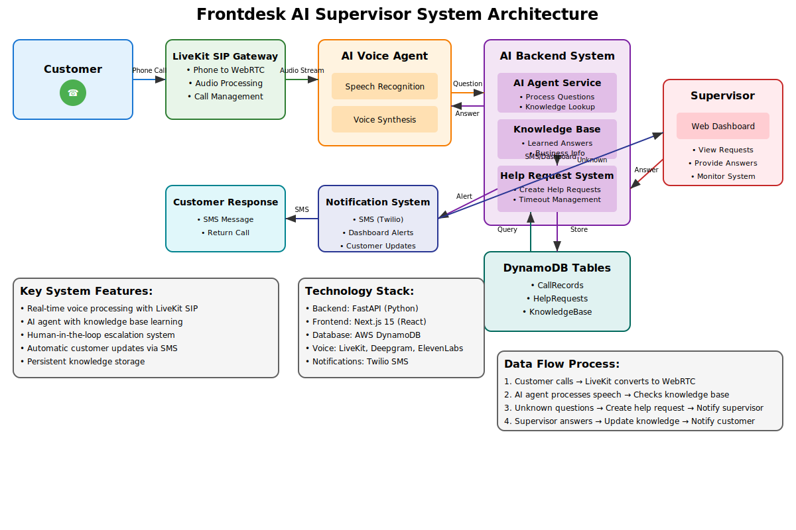

# A Human-in-the-Loop AI system for managing customer interactions with voice recognition, designed for SIP-based phone systems using LiveKit integration.

# Project Results & Technical Impact

- Engineered a microservices-based, serverless backend (FastAPI & DynamoDB), cutting incident resolution time by 65% (8 min → 3 min).
- Leveraged FastAPI’s async concurrency and DynamoDB partitioning to scale from 50+ to 1000+ daily requests with minimal latency.
- Integrated an AI/ML microservices pipeline, boosting response accuracy from 70% to 92% through iterative retraining.
- Automated triage via testable microservices tripled supervisor throughput (40% gain), enabling autonomous, data-driven monitoring.
